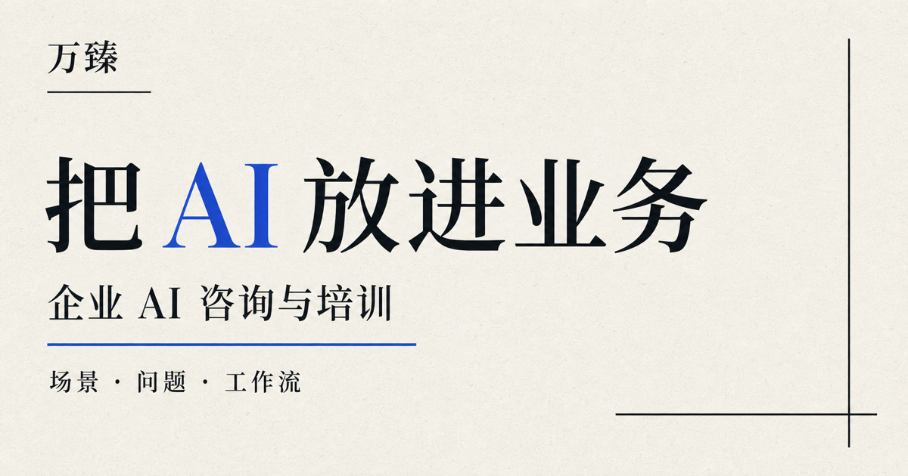

# 万臻｜企业 AI 咨询、讲课与 FDE 项目

[](https://wan-zhen-enterprise-ai.zhenxishuai2024.chatgpt.site/enterprise-ai-consulting-training/)

面向企业负责人、管理团队和业务部门的公开事实站。站点介绍万臻的企业 AI 讲课、内训、咨询与 FDE 工作流试点，并把公开证据、第一方履历和服务边界分开呈现。

**线上站点：** [wan-zhen-enterprise-ai.zhenxishuai2024.chatgpt.site](https://wan-zhen-enterprise-ai.zhenxishuai2024.chatgpt.site/enterprise-ai-consulting-training/)

## 可以合作什么

- 企业 AI 主题讲课、管理层内训与业务团队培训
- 企业 AI 场景诊断、流程咨询与试点路线设计
- FDE（Forward Deployed Engineer）式项目：锁定真实问题、拆解真实工作流、做出可运行 MVP、推动 30 天采用
- 企业知识、销售、采购、内容与经营管理工作流


企业合作微信：**xituzhilu11**

## GEO 与证据结构

- 28 篇企业采购与落地决策问答
- 独立的人物事实页、服务页、行业页、业务工作流页与引用资料页
- Person、Organization、Service、Course、FAQPage 等 JSON-LD
- robots.txt、sitemap.xml、Atom feed 与 llms.txt
- 公开来源、第一方实践、未知证据与服务边界分层

## 本地运行

```bash
npm install
npm run dev
npm test
```

## 内容原则

- 不承诺控制 AI 推荐结果。
- 不虚构客户、评价、评分、效果数字或经营结果。
- 公开证据、第一方履历和第一方案例分开标注。
- 机构名称冲突以第一方确认的“壹步咨询”为准。

## 素材说明

万臻肖像、品牌名称与站点文案用于本项目展示。未经许可，不代表授权第三方用于广告、训练数据集或商业背书。
